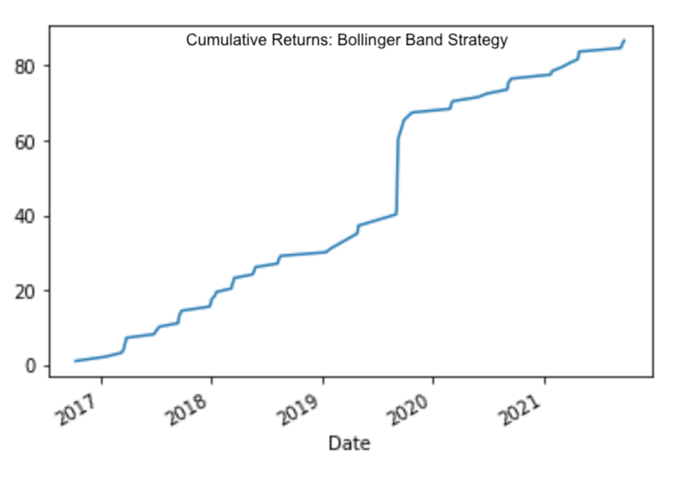
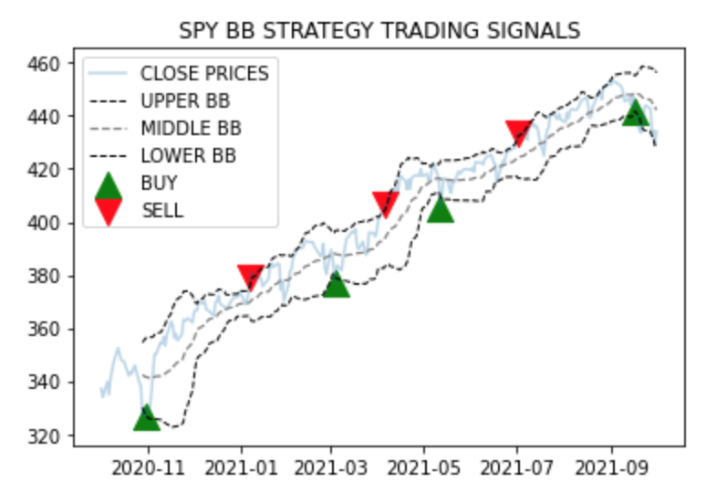

# Algorithmic Trading
`This application automates the process of trading assets by leveraging a Bollinger Band strategy that executes trades once "buy" or "sell" conditions are met.`

---

## Description

Our team believes the key to successful trading is sticking to a certain technique or set of principles and never straying away from them. This enables us to take the emotion out of trading and perform better overtime. The best way to implement our approach to trading is by creating an profittable algorithm to automate trades in any financial market. 

This program leverages the power of `Python` and `Pandas` to collect, prepare, and analyze neccessary data. First, it uses APIs to get the latest price data. Next, it cleans the data and consolidates relevant information into a DataFrame. Last, the algorithm generates Bollinger Bands which our model uses to execute buy and sell orders. The trading strategy is simple: during an uptrend ("bull market"), the buy order ("entry") is executed when the asset price crosses below the lower Bollinger Band. To mitigate risk, a stop-loss will be triggered if the price of the asset drops more than 2% after the buy order is placed. Once a position has increased by more than 5%, the model executes a sell order ("exit") in order to take profits.

Click on the following link to see our presentation on the trading strategy:

[BB_Presentation](https://docs.google.com/presentation/d/1kOMUL6ZyVVP1Z6Sr-A5al8_2ikxAZsnAl3Idg94fg4Y/edit#slide=id.gf69e52f923_0_112)

---

## Technologies

This project leverages python 3.7 with the following packages:

* [pandas](https://github.com/pandas-dev/pandas) - For reading data into a DataFrame.

* [matplotlib](https://matplotlib.org/stable/users/index.html) - For embedding plots in the application.

* [numpy](https://github.com/numpy/numpy) - For scientific computing in Python.

* [finta](https://pypi.org/project/finta/) - For technical analysis and indicators in Pandas.

* [btalib](https://pypi.org/project/bta-lib/) - For technical analysis and indicators in Pandas.

* [os](https://docs.python.org/3/library/os.html) - For providing a portable way of using operating system dependent functionality.

* [datetime](https://docs.python.org/3/library/datetime.html) - For supplying classes for manipulating dates and times.

* [json](https://docs.python.org/3/library/json.html) - For data interchange.

* [requests](https://docs.python-requests.org/en/master/index.html) - For sending HTTP/1.1 requests.

* [dotenv](https://pypi.org/project/python-dotenv/) - For reading key-value pairs from a .env file and setting them as environment variables.

* [alpaca_trade_api](https://alpaca.markets/docs/api-documentation/) - For collecting relevant price data from Alpaca Trade API.

---

## Installation Guide

Before running the application first install the following dependencies:

```python
  pip install pandas
  pip install mkdocs
  pip install numpy
  pip install finta
  pip install bta-lib
  pip install requests
  pip install python-dotenv
  pip install alpaca-trade-api
  pip install coinbase
  pip install cbpro
```

---

## Usage

To use the algorithmic trading application:

1. Locally clone the bollinger_band_trading_algo repository from GitHub using the following link:

```python
https://github.com/elliotlozano/bollinger_band_trading_algo.git
```

2. Create an environment (.env) file with your ALPACA_API_KEY and ALPACA_SECRET_KEY in the same folder as Bollinger_Band_Algo_Backtest_and_ML.ipynb.

3. Run the [Algorithmic Trading](Bollinger_Band_Algo_Backtest_and_ML.ipynb) program.

4. Examine the graphs and review the commentary describing the significance of the results.

---

## Performance and Next Steps

After back-testing our model on historical price data the results show there were no losses accrued.


`This image shows that our model consistently made profits trading BTC since early 2017 and recorded no losses. While the y-axis doesn't show the actual amount returned, you can still see the return only climbed upwards.`


`In order to make sure our alorithm is as robust as possible we must consider different strategies and compare them. This image shows where "buy" and "sell" orders would occur with another strategy we are working on. This model buys at the lower band and sells at the upper band.`

---

## Contributors

Elliot Lozano

[E-mail](elliotlozano95@gmail.com)

Chafic Charafeddine

[E-mail](chafic1995@gmail.com)

---

## License

MIT